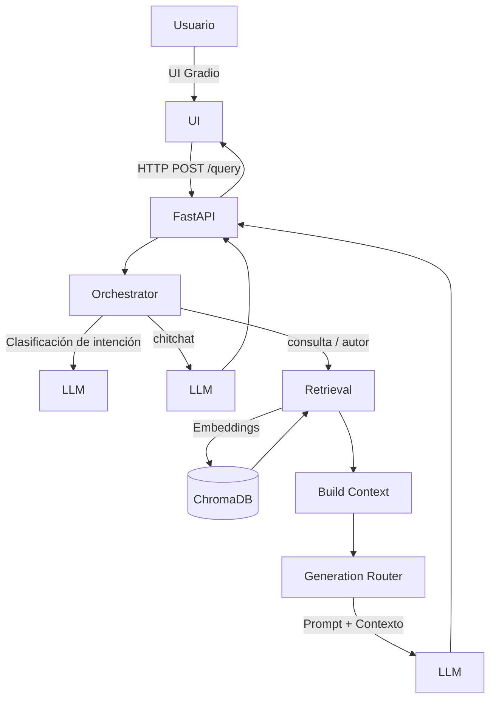
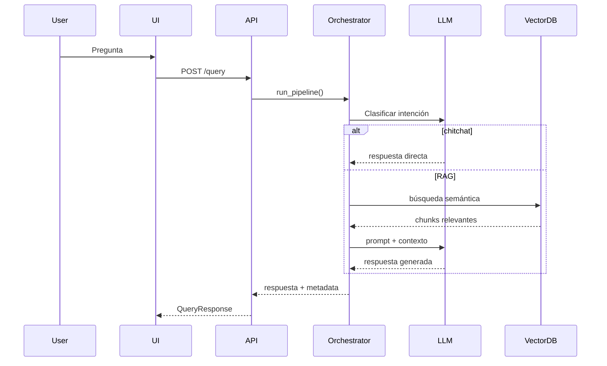

# Nombre del proyecto: ZettelRAG

Sistema Retrieval-Augmented Generation (RAG) para consulta y organización de conocimiento personal a partir de notas tipo _Zettelkasten_ (Obsidian).

Proyecto desarrollado como resolución del challenge final – Get Talent 2025 de Pi Data Strategy & Consulting.


<br>
<br>

## Objetivo:

Diseñar e implementar un sistema RAG completo que:

- Ingiere notas en Markdown (vault Obsidian)
- Construye una base vectorial persistente
- Recupera contexto relevante
- Genera respuestas fundamentadas usando un LLM
- Orquesta el flujo según la intención del usuario
- Expone el sistema vía API y UI gráfica


<br>
<br>

## Arquitectura general




<br>
<br>

## Flujo del endpoint `/query`




<br>
<br>

## Componentes principales

### Ingestión

- Lectura recursiva de archivos `.md`
- Chunking con solapamiento
- Generación de embeddings locales
- Persistencia en ChromaDB

### Retrieval + Reranking

- Recuperación inicial por similitud
- Reranking con cosine similarity
- Selección de los chunks más relevantes

### Orquestador (LLM-driven)

- Clasifica la intención del usuario:
    - `chitchat`
    - `consulta`
    - `autor`
- Decide si usar RAG o generación directa

### Generación

- Prompts estrictos y deterministas
- Respuestas siempre en español
- Uso exclusivo del contexto cuando aplica
- Transparencia (grounded / fuentes)


<br>
<br>

## Tecnologías utilizadas

- Python
- FastAPI
- Gradio
- Cohere (LLM)
- Sentence Transformers
- ChromaDB
- LangChain text splitters
- Scikit-learn


<br>
<br>

## Configuración técnica

- Modelo de embeddings: `paraphrase-multilingual-MiniLM-L12-v2`
- Dimensión: 384
- Chunk size / overlap: 2000 / 200
- Vector DB: ChromaDB (persistente)
- Metadata: `source_file`


<br>
<br>

## Ejecución del proyecto:

### 1. Preparación del entorno

```bash
python -m venv venv
venv\Scripts\activate
pip install -r requirements.txt
```

### 2. Ejecutar la API

Opción A – API legacy (sin orquestador)

```bash
cd src
uvicorn app1:app --reload
```

Swagger:

```bash
http://127.0.0.1:8000/docs
```

Opción B – API principal (con orquestador)

```bash
cd src
uvicorn app:app --reload
```

### 3. Ejecutar la UI gráfica

En una nueva terminal:

```bash
cd src
venv\Scripts\activate
python ui.py
```

UI disponible en:

```bash
http://127.0.0.1:7860
```

⚠️ La carga inicial puede demorar por la inicialización de modelos.

⚠️ Revisar las rutas en `src/ingestion.py` y `src/retrieval.py`

⚠️ Revisar las keys en `src/.env` 


<br>
<br>

## Estructura del proyecto:

```
ZettelRAG/
│
├── venv/                            # Entorno virtual de Python
│   └── (archivos del venv)          # Módulo de entorno virtual
│
│
├── src/                             # Código fuente
│   ├── __pycache__/                 # Archivos compilados de Python
│   ├── __init__.py                  # Inicialización del paquete
│   ├── .env                         # Variables de entorno (COHERE_API_KEY)
│   ├── ingestion.py                 # Script para cargar y chunkear notas
│   ├── retrieval.py                 # Módulo para la recuperación de contexto
│   ├── build_context.py             # Función de augmentación: prepara texto para el prompt
│   ├── generation.py                # Generación de respuestas
│   ├── generation_router.py         # Generación de respuestas basado en un orquestador
│   ├── orchestrator.py              # Un orquestador basado en LLM
│   ├── app.py                       # API (FastAPI) con orquestador
│   ├── app1.py                      # API (FastAPI) original sin orquestador
│   ├── ui.py                        # UI basada en Gradio que consume la API
│   └── zettelrag.log                # Archivo de registro de la aplicación
│
│
├── notebooks/                       # Jupyter notebooks si es necesario para pruebas
│   └── (notebooks para análisis)    # Ejemplos de uso, tests, experimentos
│
│
├── scripts/                         # Pequeños scripts para pruebas
│   ├── (scripts para análisis)      # Ejemplos de uso, tests, experimentos
│   ├── contador_caracteres.py       # Cantidad de caracteres en un Vault Obsidian
│   ├── modelos_embeddings.py        # Estructura de modelos para los embeddings
│   ├── prueba_librerias.py          # Carga de liberías
│   ├── test_retrieval.py            # Prueba de la recuperación
│   ├── test_build_context.py        # Prueba de generación de contexto
│   ├── test_retrieval_build_context.py  # Anterior combinado con recuperación
│   ├── test_generation.py           # Prueba de conexión al LLM
│   └── test_full_pipeline.py        # Pipeline completo sin API, sólo Python
│
│
├── vectorstore/                     # Aquí se guarda la base de datos persistente ChromaDB
│   └── (archivos de ChromaDB)       # Archivos persistentes de la base vectorial
│
│
├── louis/                           # Vault Obsidian. 6308736 caracteres
├── rosie/                           # Vault Obsidian. 102379 caracteres
│
│
├── README.md                        # Descripciones / instrucciones del proyecto
│
└── requirements.txt                 # Dependencias del proyecto
```


